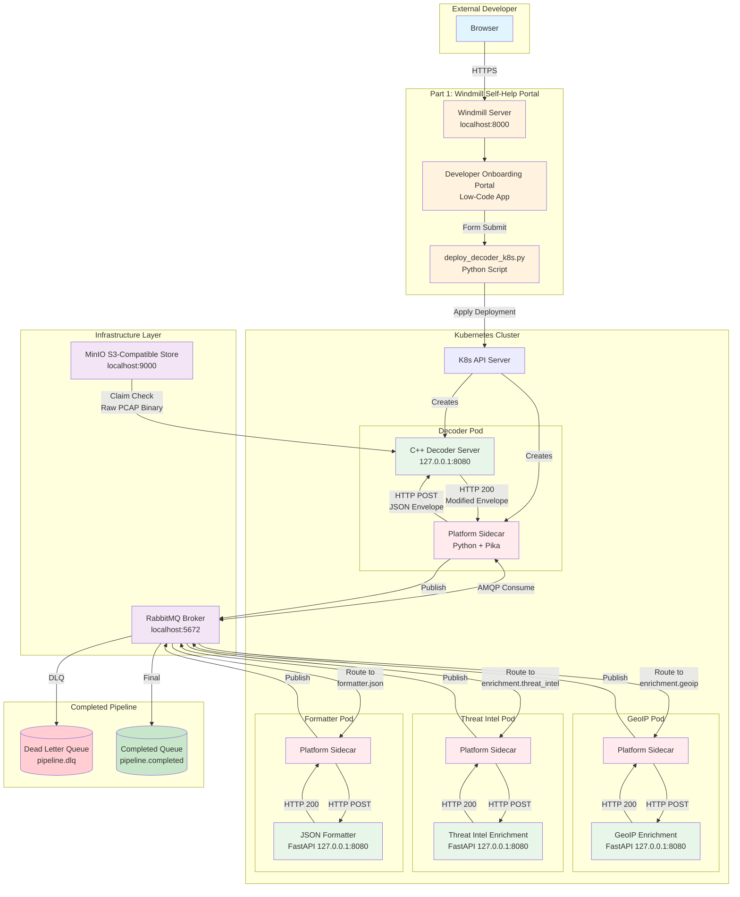
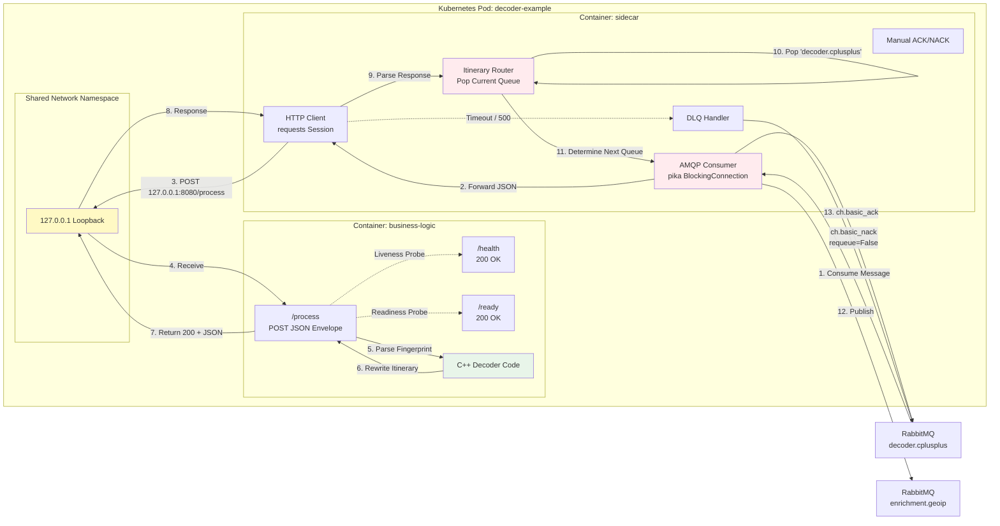
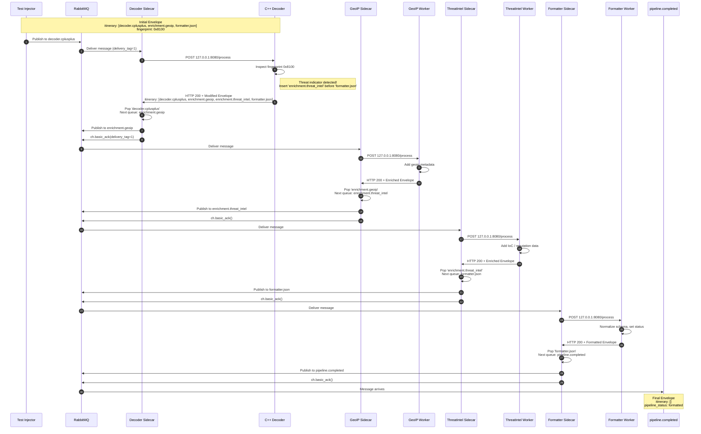
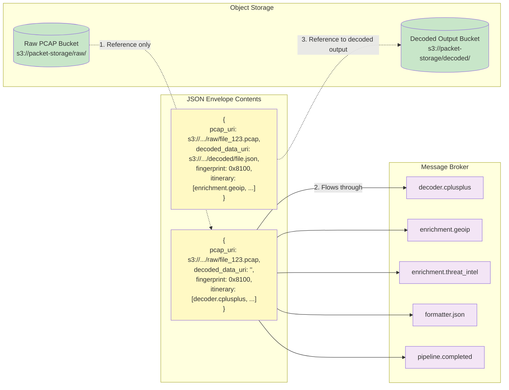
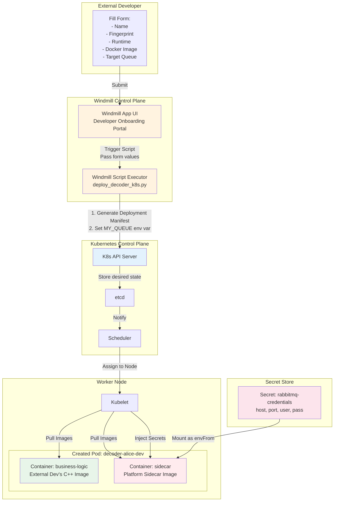
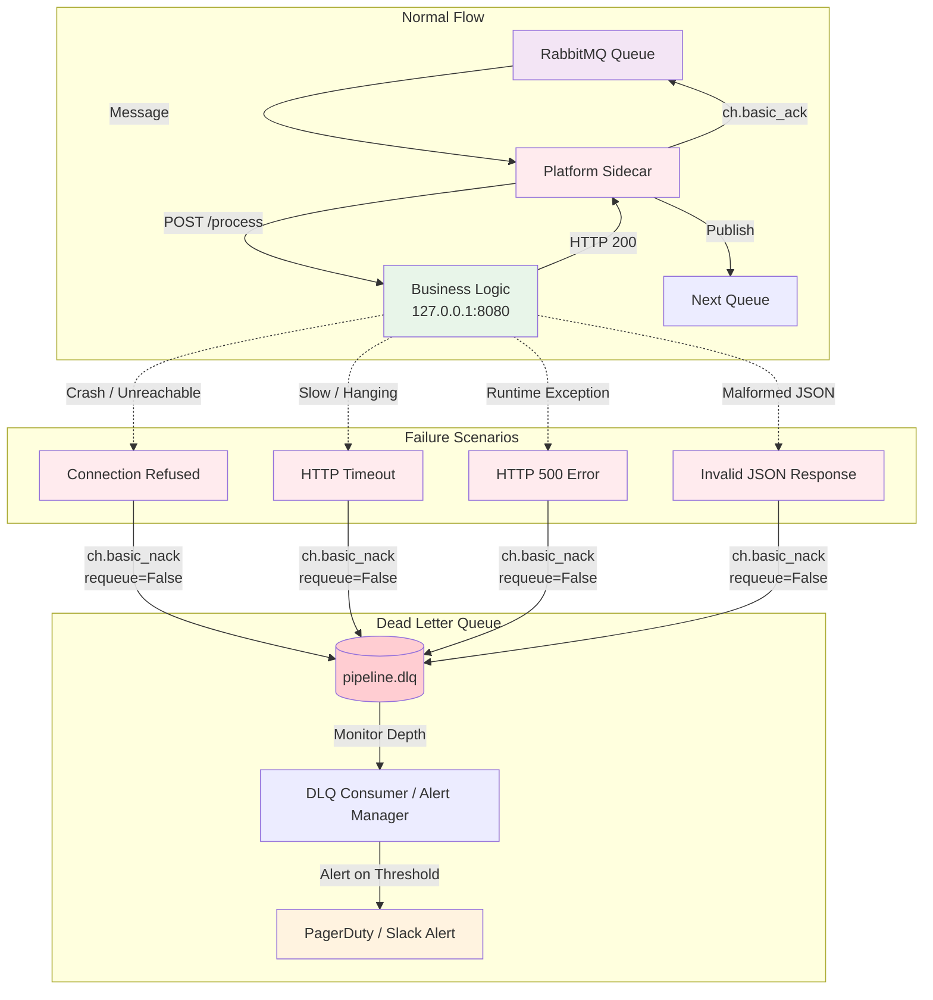
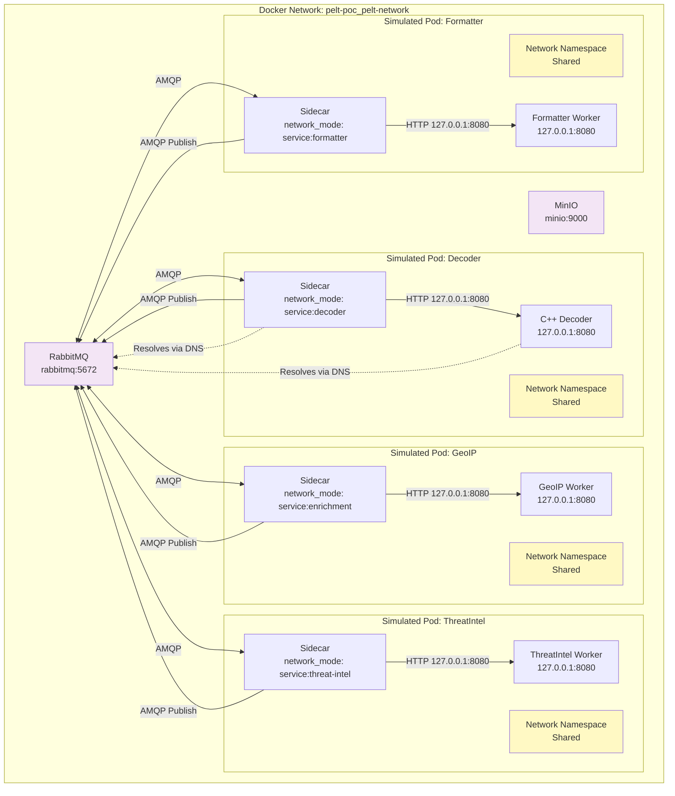

# Self-Help ELT Platform: Detailed Architecture

This document provides comprehensive architecture diagrams illustrating how all five components of the multi-tenant PCAP processing platform interconnect.

---

## 1. High-Level System Architecture

This diagram shows the complete platform from the external developer's perspective through to the final pipeline completion.

---

## 2. The Platform Sidecar Pattern (Pod-Level Detail)

This diagram zooms into a single Pod to show exactly how the business logic container and the platform sidecar share the localhost network namespace.

---

## 3. Message Flow & Dynamic Choreography

This sequence diagram shows the exact lifecycle of an Initial Envelope as it progresses through the pipeline, including the dynamic itinerary rewrite.

---

## 4. Claim Check Pattern Detail

This diagram illustrates how raw binary data never flows through the message broker — only lightweight metadata envelopes do.

---

## 5. Windmill-to-Kubernetes Deployment Flow

This diagram shows exactly what happens when an external developer clicks **Deploy Decoder** in the Windmill Self-Help Portal.

---

## 6. Error Handling & Dead Letter Queue Flow

This diagram shows what happens when the business logic container fails or returns an HTTP 500.

---

## 7. Component Relationship Matrix

| Component | Part | Technology | Interfaces With | Responsibility |
|-----------|------|------------|-----------------|----------------|
| **Windmill Server** | 1 | Docker (ghcr.io) | Browser, Worker, Postgres | Serves UI & API |
| **Windmill Worker** | 1 | Docker (ghcr.io) | Server, K8s API | Executes Python deployment script |
| **Developer Portal App** | 1 | Windmill Low-Code | Windmill Script | Form UI for developer onboarding |
| **deploy_decoder_k8s.py** | 1 | Python + kubernetes | K8s API Server | Generates & applies K8s Deployment manifests |
| **C++ Decoder Server** | 2 | C++17 + cpp-httplib | Sidecar (localhost) | Inspects fingerprint, rewrites itinerary, mocks S3 write |
| **Platform Sidecar** | 3 | Python + pika + requests | RabbitMQ, Business Logic | AMQP consumer, HTTP forwarding, ACK/NACK, DLQ routing |
| **RabbitMQ Broker** | 3/5 | RabbitMQ 3.12 | All Sidecars | Durable queues, message routing, DLQ |
| **MinIO Object Store** | 5 | MinIO | Test Seeder, C++ Decoder | S3-compatible raw PCAP & decoded output storage |
| **GeoIP Worker** | 4/5 | Python + FastAPI | GeoIP Sidecar | Adds geographic metadata to envelope |
| **Threat Intel Worker** | 4/5 | Python + FastAPI | Threat Sidecar | Adds IoC / reputation metadata to envelope |
| **Formatter Worker** | 4/5 | Python + FastAPI | Formatter Sidecar | Normalizes output schema, sets pipeline_status |
| **K8s Deployment Manifest** | 4 | YAML | Kubectl / API Server | Declares Pods, containers, security contexts, ServiceAccounts |

---

## 8. Network Topology (Docker Compose POC)

This diagram shows how the local POC simulates the Kubernetes Pod networking model using Docker Compose.

---

## How to Render These Diagrams

These diagrams use **Mermaid** syntax. You can render them in:

1. **VS Code** with the [Markdown Preview Mermaid Support](https://marketplace.visualstudio.com/items?itemName=bierner.markdown-mermaid) extension
2. **GitHub** — Mermaid is natively supported in Markdown files
3. **Any browser** via [Mermaid Live Editor](https://mermaid.live/) — copy-paste the diagram code
4. **Obsidian**, **Notion**, or **GitLab** — all support Mermaid natively

If you prefer a static image, paste any diagram block into [Mermaid Live Editor](https://mermaid.live/) and export as PNG/SVG.
